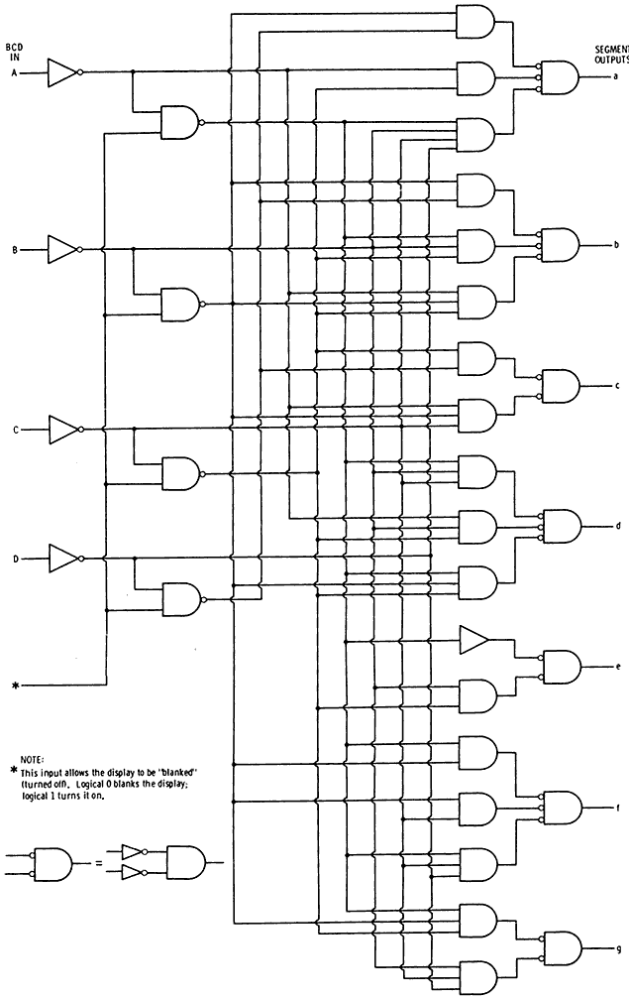

# BCD to 7-segment Decoder

## Components Required - 

* 22 NOT gates
* 10 2-input NAND gates
* 23 3-input NAND gates

## Circuit Connections - 

* With the help of the given diagram, try to connect the components in the circuit.

* After setting the values of A,B,C,and D click "Simulate". 

## Observations - 

* The values of a,b,c,d,e,f and g correspond to inputs A,B,C,D as described in the theory section.
* If the circuit has been made as described as above, then upon clicking the "Submit" button a "Success" message will be displayed.
## EQUATIONS -
a=A+C +BD + B'D'
b=B' +C'D' +CD
c=B + C'+ D
d=B'D' +CD' + BC'D + B'C + A
e = B'D' + CD'
f=A + C'D' + BC' + BD'
g=A + BC' +B'C + CD'

  

# 7-segment Display

## Components Required - 

* 1 BCD to 7-segment Decoder
* 1 7-segment Display

## Circuit Connections - 

* Connect the input points of the BCD to 7-segment Decoder with the input bits A,B,C, and D.
* Connect the output points of the BCD to the input points of the 7-segment Display, with point 'a' in Decoder corresponding to point 'a' in Display, and so on.

## Observations - 

* The inputs A,B,C,D generate digits on the display as described in the theory section.
* If the circuit has been made as described as above, then upon clicking the "Submit" button a "Success" message will be displayed.

