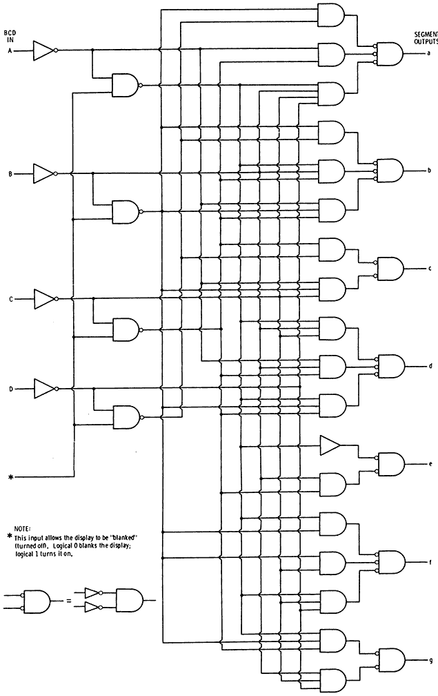
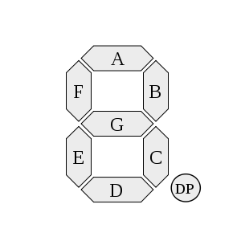

### BCD to 7-Segment Decoder

#### Circuit Diagram

_Figure 1: BCD to 7-Segment Decoder circuit diagram showing the complete combinational logic implementation using logic gates. Reference: Theory section_

#### Components Required

- 22 NOT gates
- 10 2-input NAND gates
- 23 3-input NAND gates

#### Circuit Connections

1. Drag logic gates from the Components panel on the left side to the circuit board.
2. Connect the input bits A, B, C, and D to the appropriate logic gates according to the circuit diagram.
3. Implement the Boolean expressions for each segment (a, b, c, d, e, f, g) using the required logic gates:
   - **Segment a**: a = A + C + BD + B'D'
   - **Segment b**: b = B' + C'D' + CD
   - **Segment c**: c = B + C' + D
   - **Segment d**: d = B'D' + CD' + BC'D + B'C + A
   - **Segment e**: e = B'D' + CD'
   - **Segment f**: f = A + C'D' + BC' + BD'
   - **Segment g**: g = A + BC' + B'C + CD'
4. Connect the outputs of your logic circuits to the corresponding output points (a, b, c, d, e, f, g).
5. Set the input values for A, B, C, and D by double-clicking on the input bits.
6. Click on "Simulate" to test your decoder circuit and observe the output values.

#### Observations

- The output values a, b, c, d, e, f, and g correspond to the 7-segment display patterns for BCD inputs A, B, C, D as described in the theory section.
- Each BCD input (0000 to 1001) should produce the correct 7-segment pattern for digits 0-9.
- If the circuit has been implemented correctly as described above, a "Success" message will be displayed upon clicking "Submit".

### 7-Segment Display Interface

#### Circuit Diagram

_Figure 2: 7-Segment Display with labeled segments (a, b, c, d, e, f, g) showing the complete interface system. Reference: Theory section_

#### Components Required

- 1 BCD to 7-Segment Decoder (pre-loaded)
- 1 7-Segment Display unit (pre-loaded)
- Input connections for A, B, C, D

#### Circuit Connections

1. The circuit board contains pre-loaded components: Input bits (A, B, C, D), BCD to 7-segment Decoder, and 7-segment Display.
2. Connect the input bits A, B, C, D to the corresponding inputs of the BCD decoder by dragging your cursor from one endpoint to another.
3. Connect the decoder outputs (a, b, c, d, e, f, g) to the corresponding inputs of the 7-segment display:
   - Connect decoder output 'a' to display input 'a'
   - Connect decoder output 'b' to display input 'b'
   - Continue this pattern for all seven segments (c, d, e, f, g)
4. Set the input values for A, B, C, D by double-clicking on the input bits to test different BCD combinations.
5. Click on "Simulate" to activate the display and observe the digit representation.

#### Truth Table for BCD to 7-Segment Decoder

| A   | B   | C   | D   | Digit | a   | b   | c   | d   | e   | f   | g   |
| --- | --- | --- | --- | ----- | --- | --- | --- | --- | --- | --- | --- |
| 0   | 0   | 0   | 0   | 0     | 1   | 1   | 1   | 1   | 1   | 1   | 0   |
| 0   | 0   | 0   | 1   | 1     | 0   | 1   | 1   | 0   | 0   | 0   | 0   |
| 0   | 0   | 1   | 0   | 2     | 1   | 1   | 0   | 1   | 1   | 0   | 1   |
| 0   | 0   | 1   | 1   | 3     | 1   | 1   | 1   | 1   | 0   | 0   | 1   |
| 0   | 1   | 0   | 0   | 4     | 0   | 1   | 1   | 0   | 0   | 1   | 1   |
| 0   | 1   | 0   | 1   | 5     | 1   | 0   | 1   | 1   | 0   | 1   | 1   |
| 0   | 1   | 1   | 0   | 6     | 1   | 0   | 1   | 1   | 1   | 1   | 1   |
| 0   | 1   | 1   | 1   | 7     | 1   | 1   | 1   | 0   | 0   | 0   | 0   |
| 1   | 0   | 0   | 0   | 8     | 1   | 1   | 1   | 1   | 1   | 1   | 1   |
| 1   | 0   | 0   | 1   | 9     | 1   | 1   | 1   | 1   | 0   | 1   | 1   |

#### Observations

- The 7-segment display shows the corresponding decimal digit (0-9) for each valid BCD input combination (0000-1001).
- The display segments light up according to the truth table above, creating recognizable digit patterns.
- Invalid BCD inputs (1010-1111) may produce undefined patterns on the display.
- If the connections have been made correctly as described above, a "Success" message will be displayed upon clicking "Submit".

### General Instructions

#### Navigation Between Tasks

- Use the task tabs at the top to switch between "Decoder" and "7-segment Display" tasks.
- Each task has specific components and objectives tailored to the learning goals.
- The observations section will be cleared when switching between tasks to avoid confusion.

#### Circuit Building Guidelines

- **Components**: Click on logic gates in the Components panel to add them to the circuit board.
- **Movement**: Drag and drop components to position them appropriately on the circuit board.
- **Connections**: Create wire connections by dragging from one endpoint to another.
- **Input Values**: Double-click on input bits to toggle between 0 and 1 values.
- **Wire Deletion**: Right-click on wire connections and select delete to remove unwanted connections.
- **Component Deletion**: Right-click on components and select delete to remove them from the circuit.

#### Testing and Validation

- **Simulate**: Click the "Simulate" button to test your circuit with the current input values.
- **Submit**: Click the "Submit" button to validate your complete circuit implementation.
- **Reset**: Use the "Reset" button to clear the circuit board and start over.
- **Multiple Tests**: Try different input combinations to verify your circuit works for all valid BCD inputs (0-9).
