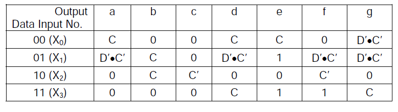
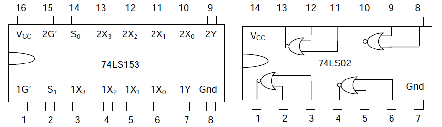

**BCD to 7-segment Decoder**

A BCD to 7-segment Decoder generates 7 outputs from a BCD (4-bit) input for driving a 7-segment LED display device to display BCD digits. A 7-segment display consists of seven segments designated as a, b, c, d, e, f and g in a clockwise sequence. An optional DP decimal point (an "eighth segment") is used for the display of non-integer numbers. In a 7-segment LED display, either all the anodes or all the cathodes of the LEDs in the seven segments are tied together and brought out at a single pin, and the device is accordingly called either a common-anode or a common-cathode display. In this experiment, we will use a common-anode display, and so the Decoder outputs are applied through resistors placed in series with the cathode of each segment. The objective of this experiment is to design, assemble and test a BCD to 7-segment Decoder generating these seven outputs. Note that each segment is lighted when the corresponding decoder output, also denoted by a, b, c, d, e, f and g, is LOW. 

|Digit | Off Segments|
|------|-------------|
|0     |	g    |
|1     | a,d,e,f,g   |
|2     |c,f          |
|3     |e,f          |
|4     |a,d,e        |
|5     | b,e         |
|6     | b           |
|7     |d,e,f,g      |
|8     | -           |
|9     |e            |	

  
	
The natural choice for a design involving 4 input variables is a 4-input multiplexer, and the best choice for the Select inputs for BCD input is BA, as that would give us the maximum benefit of don’t care combinations. 

There are only five distinct values that these 28 data inputs have, and these are 0, 1, C, C’ and D’•C’ = (D + C)’. Thus a 2-input NOR gate and an inverter are all that is needed to generate all the required data inputs. Moreover, one realises that as 4-input multiplexers come two in a chip, one multiplexer IC would only be half utilised if all the 7 outputs are generated with multiplexers, and hence one could save on the chip count if one of the segment inputs could be realised using 2-input NOR gates, already being used for generating D’•C’. Segments b, c and e have the simplest expressions and are thus possible candidates for this option. Find out which of these three would be the best choice for realisation using 2-input NOR gates. We will thus be using three dual 4-input multiplexers (74LS153), and one quad 2-input NOR gate (74LS02).

**Inputs and outputs**

|I0 |	I1 |	I2 |	I3 |	Output|
|---|------|-------|-------|----------|
|0  |	0  |	0  | 	0  |	0     |
|0  |	0  | 	0  | 	1  | 	1     |
|0  |	0  |	1  |	0  |	2     |
|0  |	0  | 	1  | 	1  | 	3     |
|0  |	1  |	0  |	0  |	4     |
|0  |	1  |	0  |	1  |	5     |
|0  | 	1  |	1  | 	0  |	6     |
|0  |	1  | 	1  | 	1  | 	7     |
|1  | 	0  | 	0  | 	0  |	8     |
|1  |	0  | 	0  |	1  |	9     |	
